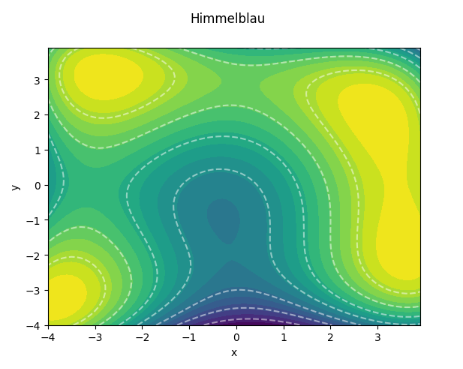
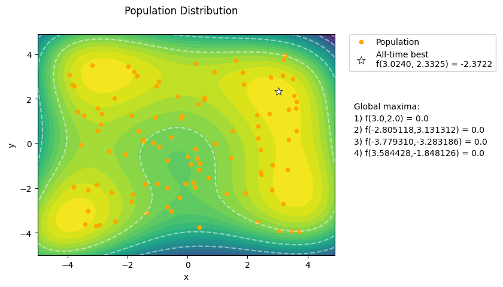

**Author:** Beatrice Occhiena s314971. See [`LICENSE`](https://github.com/beatrice-occhiena/Computational_intelligence/blob/main/LICENSE) for details.
- institutional email: `S314971@studenti.polito.it`
- personal email: `beatrice.occhiena@live.it`
- github repository: [https://github.com/beatrice-occhiena/Computational_intelligence.git](https://github.com/beatrice-occhiena/Computational_intelligence.git)

**Resources:** These notes are the result of additional research and analysis of the lecture material presented by Professor Giovanni Squillero for the Computational Intelligence course during the academic year 2023-2024 @ Politecnico di Torino. They are intended to be my attempt to make a personal contribution and to rework the topics covered in the following resources.
- [https://github.com/squillero/computational-intelligence](https://github.com/squillero/computational-intelligence)
- Stuart Russel, Peter Norvig, *Artificial Intelligence: A Modern Approach* [3th edition]

- Sean Luke, *Essentials of Metaheuristics*, 2016 [online version 2.3]
- Nikolaus Hansen, Dirk V. Arnold, Anne Auger, *Evolution Strategies*, February 2015

.

.

# Visualization Tool for Population-based Methods
In this mini-project I've tried to develop a Python program to visualize and experiment with evolutionary algorithms, in the context of optimizing complex functions with known landscapes. This will hopefully serve as a useful tool for understanding the behavior of evolutionary algorithms, and for experimenting with different parameters and operators.

## The Problem
We will consider the problem of optimizing a function of two variables, `f(x,y)`, where `x` and `y` are real numbers. The chosen function is the **Himmelblau's function**, which is a well-known test function for optimization algorithms.

## The Population
An individual in the population is a pair of real numbers, `x` and `y`. The fitness of an individual is the value of the function `f(x,y)`.
- Parameters: *population_size, generations*

## Genetic Operators
We will use the following genetic operators:
- **Mutation**: each component of the individual is mutated with a certain probability and strength. The "pervasive" version of each operator mutates all the components of the individual.
  1. `Uniform mutation`
  2. `Pervasive uniform mutation`
  3. `Gaussian mutation`
  - Parameters: *mutation_rate, mutation_strength, cooling_rate*
- **Crossover**: the crossover operator combines two individuals to produce two new individuals.
  1. `One-point crossover`
  2. `Average crossover`
  - Parameters: *crossover_rate*
- **Selection**: the selection operator selects an individual from the population, to be used as a parent for the next generation.
  1. `Tournament selection`
  - Parameters: *tournament_size*

## Visualization
This is the final result of a simulation with the following parameters:
- **Tuning parameters**:
  - `population_size = 100`
  - `generations = 10`
  - `mutation_rate = 0.3`
  - `mutation_strength = 0.5`
  - `tournament_size = 2`
  - `cooling_rate = 1`
  - `crossover_rate = 1`
- **Genetic operators**:
  - SELECTION: `tournament_selection`
  - CROSSOVER: `one_point_crossover`
  - MUTATION: `pervasive_gaussian_mutation`

## Further Developments
- [ ] Add more genetic operators
- [ ] Implement self-adaptive techniques
- [ ] Add more fitness functions
- [ ] Find a way to differentiate between genotypes and phenotypes

